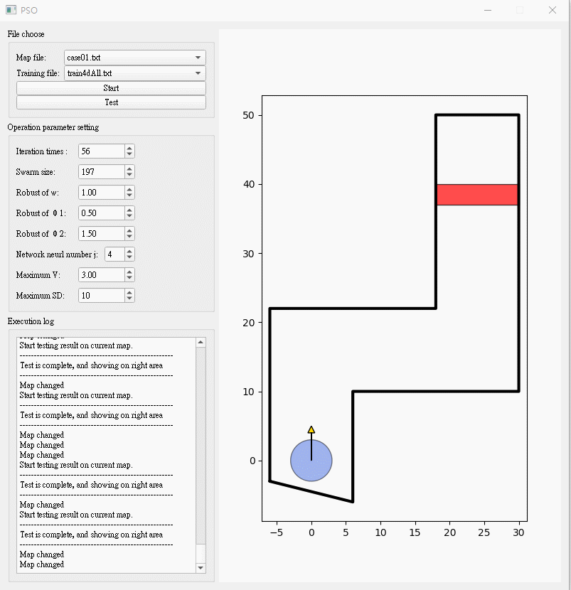

# NC
Natural Computing project, investigating PSO and ACO. This is a project by Berend van Deelen, Jeroen Vermazeren and Franka Buytenhuijs. 

# Run Continuous Benchmarks
To replicate our results on the continuous benchmarks the python notebook NC_Run_Continuous.ipynb can be used. This runs ACO and PSO on four different continuous problems: the Rosenbrock function, the Rastrigin function, the Sphere function, and the Styblinski-Tang function.

# Run Discrete Benchmarks 
As discrete benchmarks we used bays29.tsp, ch130.tsp, and tsp225.tsp. Our results on these problems can be run with ACO-tsp.ipynb for Ant Colony Optimization and PSO-TSP.ipynb for Particle Swarm Optimization. 

# Run Car Simulator
For the car simulator use the folders: ACO_car_simulation and PSO_car_simulation. To run the car simuator, simply use run the main.py. 

The PSO version of the car simulator originates from: https://github.com/daniel4lee/PSO-car-simulator

An example run of the PSO car simulator:

